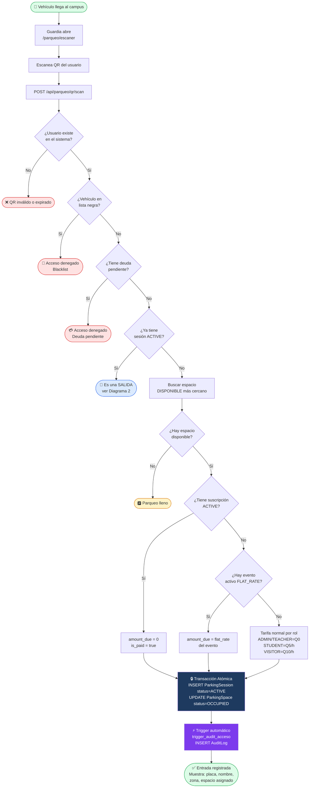
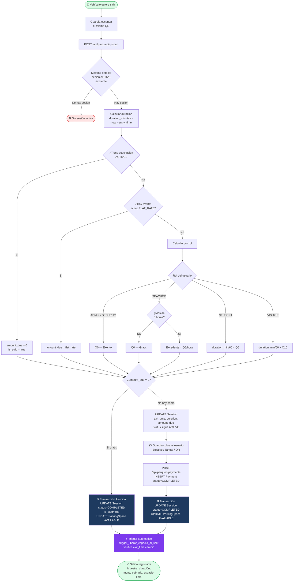
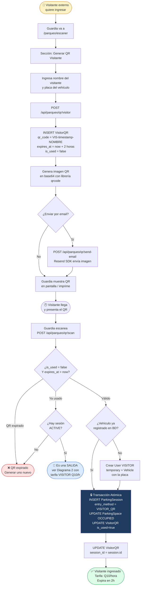
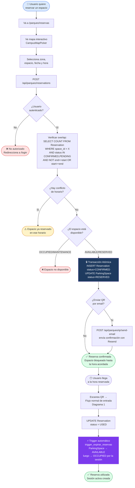
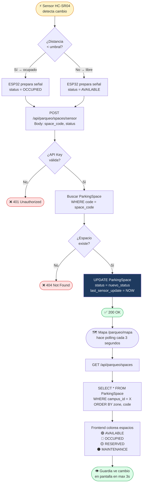

# Diagramas UML de Actividades — Smart Parking USPG Grupo 5
> Pega cada bloque en **https://mermaid.live** para verlo y exportarlo

---

## Diagrama 1 — Entrada de Vehículo (QR)



---

## Diagrama 2 — Salida y Pago



---

## Diagrama 3 — Visitante con QR Temporal



---

## Diagrama 4 — Reserva de Espacio



---

## Diagrama 5 — Autenticación y Control de Acceso

```mermaid
flowchart TD
    A([👤 Usuario accede\nal sistema]) --> B[Va a /login]
    B --> C[Ingresa email\ny contraseña]
    C --> D[POST /api/parqueo/auth]

    D --> E{¿Usuario existe\nen BD?}
    E -- No --> F([❌ Credenciales inválidas])
    E -- Sí --> G[bcrypt.compare\ncontraseña vs password_hash]

    G --> H{¿Contraseña\ncorrecta?}
    H -- No --> I([❌ Credenciales inválidas])
    H -- Sí --> J{¿is_active = true?}

    J -- No --> K([🚫 Cuenta desactivada])
    J -- Sí --> L[Generar tokens JWT\nAccess Token: 1 hora\nRefresh Token: 7 días\nPayload: id, email, role]

    L --> M[UPDATE User\nlast_login_at = NOW]
    M --> N([✅ Login exitoso\nRedirecciona según rol])

    N --> O{Rol del usuario}
    O -- ADMIN --> P[/parqueo/dashboard\nAcceso total]
    O -- SECURITY --> Q[/parqueo/escaner\n/parqueo/seguridad]
    O -- TEACHER --> R[/parqueo/reservas\nVista docente]
    O -- STUDENT --> S[/parqueo/reservas\nVista estudiante]

    P --> T{Cada request\nal API}
    Q --> T
    R --> T
    S --> T

    T --> U[Middleware verifica\nAuthorization: Bearer token]
    U --> V{¿Token válido\ny no expirado?}
    V -- No --> W[POST /api/parqueo/auth/refresh\ncon Refresh Token]
    W --> X{¿Refresh válido?}
    X -- No --> Y([🔒 Sesión expirada\nVolver a /login])
    X -- Sí --> Z[Nuevo Access Token\n1 hora más]
    Z --> T
    V -- Sí --> AA{¿Rol autorizado\npara esta ruta?}
    AA -- No --> AB([🚫 Forbidden 403])
    AA -- Sí --> AC([✅ Request procesado])

    style A fill:#dbeafe,stroke:#2563eb
    style F fill:#fee2e2,stroke:#dc2626
    style I fill:#fee2e2,stroke:#dc2626
    style K fill:#fee2e2,stroke:#dc2626
    style Y fill:#fee2e2,stroke:#dc2626
    style AB fill:#fee2e2,stroke:#dc2626
    style L fill:#1e3a5f,color:#fff
    style AC fill:#dcfce7,stroke:#16a34a
    style N fill:#dcfce7,stroke:#16a34a
```

---

## Diagrama 6 — Sensor IoT (ESP32) en Tiempo Real



---

## Cómo usar estos diagramas

1. Ve a **https://mermaid.live**
2. Borra el contenido por defecto
3. Copia el bloque ` ```mermaid ... ``` ` del diagrama que quieras
4. Pégalo — el diagrama aparece a la derecha
5. Exporta con el botón **PNG** o **SVG**

> Para el examen se recomienda imprimir los **Diagramas 1, 2 y 4** (entrada, salida y reserva) que son los flujos más preguntados por los catedráticos.
